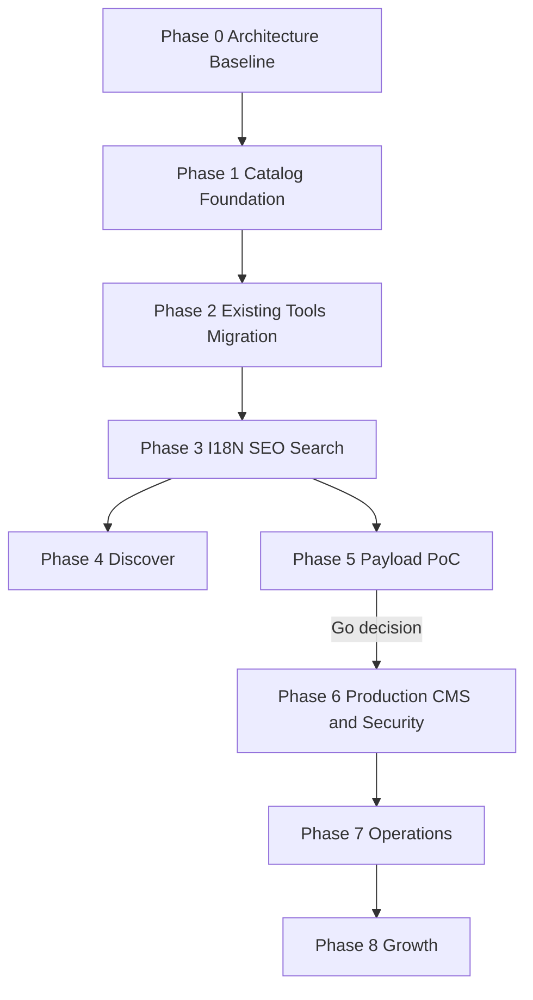
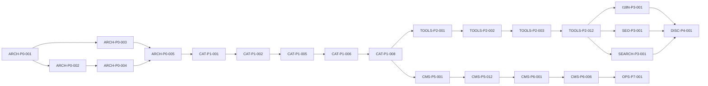

# GoDeskHub Platform Roadmap

## Planning scope

This document assesses the repository at `main` commit `21c3eb8` and decomposes the approved GoDeskHub Resource Discovery & Tools Platform architecture. It does not implement Catalog, Discover, CMS, PostgreSQL, DNS, or production changes.

## A. Current State Assessment

### Repository and delivery baseline

| Item | Current evidence |
| --- | --- |
| Repository | `/Users/noland/Documents/Codex/web-tools` |
| Planning branch | `docs/TASK-095-platform-architecture-planning`, created from current `origin/main` |
| Baseline commit | `21c3eb8` |
| Worktree at discovery | Clean; ignored `tasks/` board present |
| Runtime | Node `v22.23.1`; package requirement `>=22.13.0 <23` |
| Package manager | npm `10.9.8` with `package-lock.json` |
| Frontend | React 19.2.6, TypeScript 5.9.3, Vite 8.1.5 |
| Hosting | Cloudflare Pages, build output `dist` |
| Cloudflare Functions | Source exists for IP lookup/RDAP, but `_routes.json` exposes only a disabled placeholder |
| CI | GitHub Actions on `main` push and PR; npm ci, lint, test, build |
| Verification | `npm run verify` adds typecheck and generated route/SEO verification |

### Published registry baseline

- 27 registered public tools.
- 5 categories.
- 3 locales: `en`, `zh-CN`, and `zh-TW`.
- 4 information pages.
- 111 canonical static routes: `3 × (1 home + 27 tools + 5 categories + 4 information pages)`.
- Stable localized routes, canonical URL, hreflang, Open Graph, JSON-LD, Sitemap, custom 404, and legacy redirects are generated from code registries.
- Tool input is browser-local except explicitly isolated network-function source; standard Google Analytics page-view code is present in the HTML template.
- The current search index is local and dependency-free, but it indexes only tools.
- FAQ is a required array embedded inside each localized tool-content record rather than an independent entity.

### Current ownership map

| Concern | Current source |
| --- | --- |
| Tools, categories, locales, basic localized metadata | `src/registry.js` |
| Compatibility category/tool views | `src/catalog.ts` |
| Long-form tool guidance and embedded FAQ | `src/content/*` |
| Category guidance | `src/content/category-content.js` |
| Tool behavior contracts | `src/lib/tool-contracts.js` |
| Route enumeration | `src/lib/routes.js` |
| SEO and JSON-LD | `src/lib/seo.js` |
| Search | `src/lib/search.js` |
| Static HTML | `src/lib/static-content.js`, `scripts/generate-static-pages.mjs` |
| Build verification | `scripts/verify-build.mjs`, `tests/*.test.mjs` |

### Baseline quality evidence

On 2026-08-11, `npm ci`, `npm run lint`, `npm run test`, `npm run build`, and `npm run verify` exited successfully. The suite reported 159 tests passed, 0 failed, 0 skipped. Build and verification both reported 111 canonical static pages.

### Recorded baseline gaps and disposition

1. The `main@21c3eb8` README and older architecture prose contained superseded counts; ARCH-P0-007 corrected the planning branch documentation and ADR-025 defined registry-derived snapshots.
2. The baseline private board contained duplicate-looking support documents and an abandoned active UI program; ARCH-P0-007 moved support material to artifacts and normalized the abandoned tasks without reusing IDs.
3. `src/registry.js` is a useful tool-site registry but is not a Resource Platform Catalog: it has no website/guide resources, tags, collections, relations, health, or publication lifecycle.
4. Google Analytics page views exist while the final ADR-024 consent-gated adapter is not implemented. Tool-input privacy remains enforced, but the current tag is a recorded migration gap.
5. GitHub Actions runs install, lint, test, and build but does not invoke the static artifact verifier directly.

## B. Gap Analysis

| Area | Current | Target | Gap | Risk | Phase |
| --- | --- | --- | --- | --- | --- |
| Platform boundary | One Tools frontend | Discover + Tools + Content sharing Catalog | No shared platform contract or Discover app | High | P0–P4 |
| Core entity | Tool records | Resource with website/tool/guide types | Current registry is tool-specific | High | P0–P1 |
| Localization | Localized fields nested in JS objects | Separate locale entities | Identity and translations are coupled | High | P1–P3 |
| Taxonomy | Five flat categories | Category + Tag + Collection | No tags, collections, or taxonomy validation | High | P1 |
| FAQ | Embedded per tool locale | Independent FAQ entity | Cannot reuse, govern, or relate FAQ records | Medium | P1–P2 |
| Relations | Related tools inferred by category | Typed ResourceRelation | No explicit relation graph | Medium | P1–P4 |
| Health | Manual/current tests | ResourceHealth and review queues | No external link or content-health model | Medium | P1, P7 |
| Lifecycle | All registry entries effectively public | draft/review/published/deprecated/hidden | No publication gating | High | P1, P5 |
| Source of truth | Multiple code modules | Validated Catalog | Metadata, content, FAQ, SEO remain distributed | High | P1–P2 |
| Schema | TypeScript interfaces and custom validators | CMS-neutral TypeScript + Zod package | No reusable domain package | High | P1 |
| Authoring | Edit source code | Git/YAML, later CMS GUI | No content-authoring format or CLI | High | P1 |
| Tool binding | React switch/kind routing | Stable tool ID → implementation registry | Binding is implicit and distributed | High | P2 |
| Search | Tools only | Tools + websites + guides | Index schema lacks resource type and shared Catalog input | Medium | P3 |
| SEO | Strong tool-site static SEO | Catalog-driven multi-frontend SEO | No resource-type/status policy | Medium | P3–P4 |
| Discover | Apex redirects to Tools | Discovery frontend | App does not exist | High | P4 |
| CMS | None | Payload + PostgreSQL editor | No PoC, workflow, RBAC, or operator proof | High | P5 |
| Admin security | None | Access + CMS auth + RBAC | Entire admin trust boundary is absent | Critical | P6 |
| Migration | No shared migration tooling | YAML → validation → import → reconciliation | No import, snapshot, or cutover process | High | P6 |
| Operations | Build/test dashboards only | editorial and health operations | No review queues, ordering, or link checks | Medium | P7 |
| Analytics | Standard page views + local tool stats | governed search/resource/tool signals | Policy and event schema are not unified | High | P0, P7 |
| Documentation | Tool-site architecture | platform/domain/CMS/security/migration docs | Existing docs are narrow and counts drift | Medium | P0 |
| CI | lint/test/build | schema, catalog, security, migration gates | No Catalog validation or schema-change gates | High | P1, P6 |

## Architecture approach considered

### Recommended: incremental shared package and Catalog in the existing repository

Add CMS-neutral schemas as a private internal npm workspace package and keep the Git/YAML Catalog beside the current root Tools app. Then introduce compatibility adapters and migrate in batches. This preserves the existing Cloudflare Pages delivery path and allows Discover and the CMS PoC to consume the same normalized contract without rewriting or moving Tools. ADR-021 records the accepted topology.

### Alternative: immediate monorepo application move

Move Tools under `apps/tools` before Catalog work. This creates clean long-term boundaries but forces path, build, CI, and deployment churn before the domain model is proven. It is not recommended for Phase 1.

### Alternative: separate Catalog repository immediately

Create an independent Catalog repository and package distribution workflow. This provides strong ownership separation but adds versioning, publishing, authentication, and cross-repository CI before a second frontend exists. ADR-021 evaluated and rejected this option for the initial phases; its documented triggers allow a future review when ownership or distribution requirements change.

## C. Complete Phase Plan

| Phase | Outcome | Entry gate | Exit gate |
| --- | --- | --- | --- |
| Phase 0 — Architecture Baseline | Audited baseline, naming, domain/lifecycle decisions, ADR and migration inventory | Approved planning backlog | P0 architecture decisions accepted and evidence captured |
| Phase 1 — Catalog Foundation | Typed schema package, Git/YAML Catalog, loader, validator, fixtures, CI | Phase 0 P0 tasks complete | Catalog validates representative resources and produces normalized output |
| Phase 2 — Existing Tools Migration | Tools metadata/content progressively owned by Catalog with explicit code binding | Stable Catalog loader/validator | All current tools migrate without URL, behavior, SEO, privacy, or deployment regression |
| Phase 3 — Localization / SEO / Search | Shared localized content, metadata, Sitemap, and resource search architecture | Catalog-backed tool records available | Three resource types are supported by schemas and build pipelines; Tools remains stable |
| Phase 4 — Discover Application | `godeskhub.com` becomes the Resource discovery frontend | Catalog and Phase 3 contracts stable | Discover pages, search, SEO, accessibility, and static deployment pass production gates |
| Phase 5 — Payload CMS PoC | Independent CMS proves schema, workflow, RBAC, deployment, and operator usability | Domain model stable; Discover may proceed in parallel | Documented Go/No-Go with no production data dependency |
| Phase 6 — Production CMS Migration | Production database, import, reconciliation, cutover, rollback, and security | Phase 5 Go decision | CMS is authoritative, secure, recoverable, and reconciled |
| Phase 7 — Operations Platform | Editorial dashboards, health queues, analytics, ordering, and readiness | Production CMS stable | Operators can maintain and measure Catalog health safely |
| Phase 8 — Growth | Future product expansion | Separate product approvals | Each item has its own validation and privacy/business case |

## D. Complete Task Backlog

The authoritative detailed backlog is in `docs/planning/godeskhub-task-backlog.md`. IDs are permanent and must not be renumbered. It contains 115 tasks: 56 P0, 43 P1, 6 P2, and 10 P3. Phase 8 accounts for all 10 P3 Future / Not MVP tasks.

### Cross-cutting coverage

| Concern | Primary tasks | Rule across all tasks |
| --- | --- | --- |
| Unit/schema/integration/E2E/regression testing | `CAT-P1-010`, `I18N-P3-006`, `SEO-P3-006`, `SEARCH-P3-006`, `DISC-P4-010`, `CMS-P5-012` | Each implementation task has its own validation and rollback evidence. |
| CI/CD | `CAT-P1-012`, `DISC-P4-010`, `CMS-P5-007`, `CMS-P6-006` | lint, typecheck, test, Catalog validation, build, artifact verification, and security gates remain required. |
| Documentation | `ARCH-P0-007`, `CAT-P1-005`, `DISC-P4-010`, `CMS-P5-012`, `OPS-P7-012` | Architecture, developer, operator, deployment, migration, and security documentation change with their owning feature. |
| Accessibility | Tool migration tasks, `I18N-P3-006`, `SEARCH-P3-006`, `DISC-P4-002`, `DISC-P4-010`, operator UI tasks | Keyboard, focus, screen-reader names, contrast, semantic HTML, mobile, and 200% zoom are release gates. |
| Performance | `CAT-P1-011`, `SEARCH-P3-002`, `DISC-P4-010`, `OPS-P7-005` | Static-first output, lazy loading, bounded assets, deterministic indexes, and bounded jobs are required. |
| Security and privacy | `ARCH-P0-006`, `SEARCH-P3-005`, `SEC-P6-001`–`SEC-P6-012` | Tool input stays local; public artifacts contain public fields only; secrets and executable content never enter Catalog. |

## E. Dependency Graph

### Critical task path

### Parallel work

- After the normalized Catalog contract is stable, schema fixtures, authoring documentation, and CI integration can proceed in parallel.
- Phase 2 migration batches can run in parallel only when they touch disjoint resource records and share the same compatibility adapter.
- I18N, SEO, and Search can proceed partly in parallel after Catalog-backed resource and locale contracts are stable.
- Discover and the Payload PoC can proceed in parallel after Phase 3 contracts stabilize; neither should redefine the domain schema independently.
- Security threat modeling and infrastructure comparison can start during the CMS PoC, but production security controls remain Phase 6 gates.
- Phase 7 dashboard, ordering, health, and analytics work can be parallelized after production publication and audit contracts are stable.

## F. Recommended Execution Order — Next 10 Tasks

1. `ARCH-P0-001` — Freeze the repository architecture baseline. **Completed: baseline frozen at `main@21c3eb8`.**
2. `ARCH-P0-002` — Produce the complete existing-resource and tool migration inventory. **Completed: inventory generated with 42 logical records, 111 canonical routes, 12 localized redirects, and retained information-page target warnings for later schema work.**
3. `ARCH-P0-003` — Decide Catalog repository/package topology. **Completed: ADR-021 accepted.**
4. `ARCH-P0-004` — Freeze IDs, slugs, locale, and task naming conventions. **Completed: ADR-022 accepted.**
5. `ARCH-P0-005` — Define domain entities and publication lifecycle semantics. **Completed: ADR-023 accepted.**
6. `ARCH-P0-006` — Reconcile analytics and privacy policy before platform events expand. **Completed: ADR-024 accepted.**
7. `ARCH-P0-007` — Repair current documentation and task-board status drift. **Completed: ADR-025 accepted.**
8. `ARCH-P0-008` — Approve the migration and rollback baseline. **Completed: migration batch, source-of-truth, snapshot, comparison, and rollback gates are defined.**
9. `CAT-P1-001` — Bootstrap the CMS-neutral schema package.
10. `CAT-P1-002` — Implement Resource, ResourceLocale, and PublicationStatus schemas.

## G. Migration Risks

| Risk | Failure mode | Planned mitigation |
| --- | --- | --- |
| Routes | Stable tool URLs change or legacy redirects disappear | Freeze route inventory, assert generated paths, use compatibility adapters |
| SEO | Canonical, hreflang, JSON-LD, or Sitemap diverges between sources | Generate all metadata from normalized Catalog and compare built artifacts |
| Tools | Metadata migration accidentally changes algorithms or UI state | Keep tool binding separate; migrate metadata in batches with behavior regression tests |
| Cloudflare | New runtime or Functions captures static routes | Preserve Pages output contract and validate `_routes`, redirects, assets, and 404 |
| Localization | Missing locale silently falls back in published pages | Explicit fallback policy, completeness CLI, publication gating |
| Source of truth | YAML and code or CMS both accept authoritative edits | One writer per stage; compare-only dual read; explicit cutover switch |
| CMS coupling | Payload fields distort the domain schema | Map from CMS-neutral schemas and document adapter differences |
| Database cutover | Records, IDs, slugs, or relations are lost | Dry-run import, counts and checksum reconciliation, snapshot rollback |
| Privacy | Search or analytics captures tool input | Typed event allowlist, privacy tests, no raw query/content in analytics |
| Operations | Broken links are auto-removed | Health status enters a review queue; no automatic deletion |

## H. Blocking Decisions

Resolved decisions:

- **Catalog repository topology** — ADR-021 keeps the Catalog in this repository, introduces a private internal npm workspace package, leaves Tools at the root, and defines explicit future split triggers.
- **Identifier namespace** — ADR-022 uses globally unique readable typed immutable IDs while preserving existing tool binding IDs and public slugs.
- **Publication locale minimums and lifecycle** — ADR-023 requires complete `en`, `zh-CN`, and `zh-TW` content for every published entity and separates working revisions from the last approved public projection.
- **Analytics consent and privacy boundary** — ADR-024 retains only controlled canonical page views after affirmative Basic Consent Mode choice, keeps local popularity local, reserves future event schemas without enabling them, and uses a two-month event/user retention baseline.
- **Documentation and private-board authority** — ADR-025 makes executable registries authoritative, limits prose counts to dated snapshots, gives each private task ID one authority record, and preserves rejected local Git history without treating it as current work.

1. **Discover repository/application boundary before Phase 4:** same repository as a separate app versus a separate repository consuming a versioned Catalog artifact.
2. **Payload PoC hosting target before deployment spike:** choose only the PoC comparison set, not the final production provider.

Neither remaining decision blocks the early Catalog schema and validation foundation. They must be resolved before their respective Discover and Payload implementation phases.

## I. Deferred Decisions

- Final managed PostgreSQL provider.
- Final production host for Payload.
- Advanced search engine or paid search SaaS.
- Recommendation ranking algorithm.
- Paid analytics or data warehouse.
- Media CDN/provider beyond the PoC.
- AI model/provider for future summaries or metadata.
- Monetization and sponsored-resource commercial rules.
- User account and personalization architecture.

## J. Documentation Plan

| Document | Current action | Future owner task |
| --- | --- | --- |
| `docs/architecture/platform-architecture.md` | Created planning baseline | `ARCH-P0-001` |
| `docs/architecture/catalog-domain-model.md` | Created target model | `ARCH-P0-005` |
| `docs/architecture/cms-architecture.md` | Created target boundary | `CMS-P5-001` |
| `docs/architecture/security-architecture.md` | Created security baseline | `SEC-P6-001` |
| `docs/architecture/analytics-privacy-contract.md` | Created governed event and consent baseline | `ARCH-P0-006`, expanded by `SEARCH-P3-005` and `OPS-P7-010` |
| `docs/architecture/migration-strategy.md` | Created staged strategy | `ARCH-P0-008` |
| `docs/adr/README.md` | Maintained through accepted ADR-025 | Subordinate architecture decision tasks |
| Catalog authoring guide | Planned | `CAT-P1-012` |
| Schema developer guide | Planned | `CAT-P1-001` |
| Discover developer/deployment guide | Planned | `DISC-P4-010` |
| CMS operator guide | Planned | `CMS-P5-011`, finalized by `OPS-P7-012` |
| CMS deployment and rollback runbook | Planned | `CMS-P6-007`, `SEC-P6-011` |
